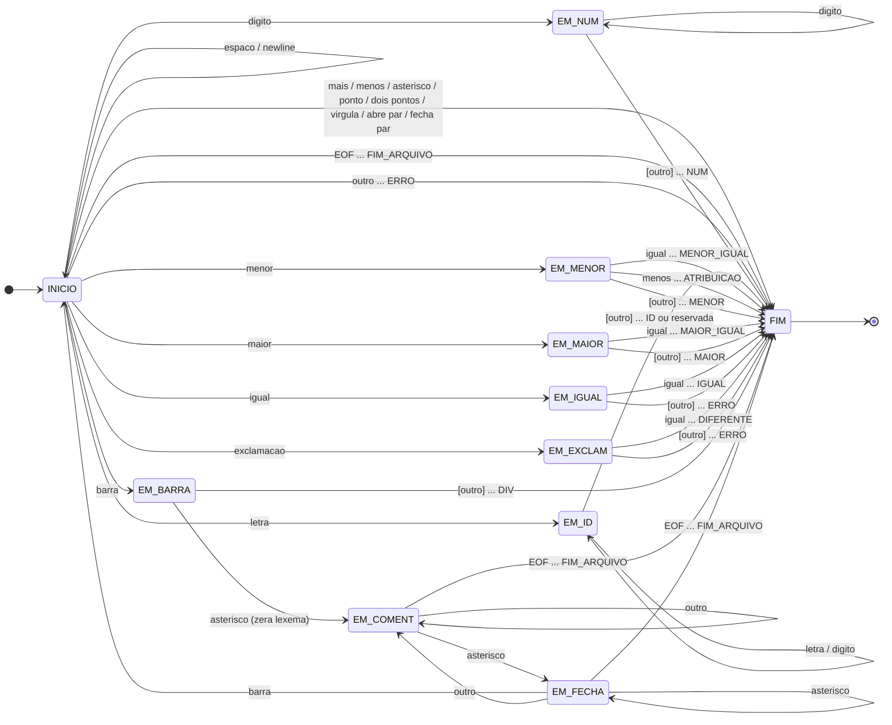

# Especificação léxica da linguagem Domus

Documento de design do analisador léxico. Define o conjunto de tokens, as definições regulares,
o autômato finito determinístico (AFD) de reconhecimento e a tabela de transição que o código-fonte
implementa diretamente.

Fonte normativa: *Convenções léxicas da linguagem Domus* e *Trabalho 1 – Compiladores*.

---

## 1. Lexemas e tokens

A linguagem possui **33 tipos de token**, agrupados em quatro categorias.

### 1.1 Tokens de controle (2)

| Token | Lexema | Atributo | Categoria |
|---|---|---|---|
| `FIM_ARQUIVO` | (nenhum — condição de fim de entrada) | — | Controle |
| `ERRO` | qualquer caractere ou sequência não reconhecida | o lexema ofensor | Controle |

### 1.2 Palavras reservadas (13)

O lexema é fixo e coincide com o nome do token. Nenhuma delas possui atributo.

| Token | Lexema | Atributo | Categoria |
|---|---|---|---|
| `SENSOR` | `sensor` | — | Palavra reservada |
| `ATUADOR` | `atuador` | — | Palavra reservada |
| `PORTA` | `porta` | — | Palavra reservada |
| `ANALOGICO` | `analogico` | — | Palavra reservada |
| `DIGITAL` | `digital` | — | Palavra reservada |
| `SE` | `se` | — | Palavra reservada |
| `ENTAO` | `entao` | — | Palavra reservada |
| `SENAO` | `senao` | — | Palavra reservada |
| `FIM_SE` | `fim_se` | — | Palavra reservada |
| `ENQUANTO` | `enquanto` | — | Palavra reservada |
| `FIM_ENQUANTO` | `fim_enquanto` | — | Palavra reservada |
| `LER` | `ler` | — | Palavra reservada |
| `ESCREVER` | `escrever` | — | Palavra reservada |

A comparação é **sensível a maiúsculas e minúsculas**: `SENSOR` e `Sensor` são identificadores,
não palavras reservadas. A especificação lista todas as palavras-chave em minúsculas.

### 1.3 Tokens multicaractere (2)

São os únicos tokens cujo lexema varia; por isso são os únicos que carregam atributo.

| Token | Lexema | Atributo | Categoria |
|---|---|---|---|
| `ID` | sequência que casa com *identificador* | o nome do identificador | Multicaractere |
| `NUM` | sequência que casa com *numero* | o valor inteiro lido | Multicaractere |

### 1.4 Símbolos especiais (16)

| Token | Lexema | Atributo | Categoria |
|---|---|---|---|
| `SOMA` | `+` | — | Símbolo |
| `SUB` | `-` | — | Símbolo |
| `MULT` | `*` | — | Símbolo |
| `DIV` | `/` | — | Símbolo |
| `MENOR` | `<` | — | Símbolo |
| `MENOR_IGUAL` | `<=` | — | Símbolo |
| `MAIOR` | `>` | — | Símbolo |
| `MAIOR_IGUAL` | `>=` | — | Símbolo |
| `IGUAL` | `==` | — | Símbolo |
| `DIFERENTE` | `!=` | — | Símbolo |
| `ATRIBUICAO` | `<-` | — | Símbolo |
| `PONTO` | `.` | — | Símbolo |
| `DOIS_PONTOS` | `:` | — | Símbolo |
| `VIRGULA` | `,` | — | Símbolo |
| `ABRE_PAR` | `(` | — | Símbolo |
| `FECHA_PAR` | `)` | — | Símbolo |

**Total: 2 + 13 + 2 + 16 = 33 tokens.**

---

## 2. Definições regulares

```
digito        = [0-9]
letra         = [a-zA-Z_]
numero        = digito digito*
identificador = letra ( letra | digito )*
espaco        = [ \t\r]+
newline       = \n
comentario    = "/*" ( qualquer caractere )* "*/"
```

### Observações

**O caractere `_` pertence à classe *letra*.** A especificação define
*letra* → `[a-zA-Z_]` explicitamente. A consequência é estrutural, e não cosmética: as palavras
reservadas `fim_se` e `fim_enquanto` contêm `_`. Se `_` ficasse fora da classe *letra*, `fim_se` seria
lido como três tokens (`fim`, erro em `_`, `se`) e a linguagem deixaria de ser reconhecível.

**Números são sempre sem sinal.** Não existe produção para sinal em *numero*. Em `asd - 1`, o `-` é
sempre o operador `SUB`; a interpretação de um literal negativo é responsabilidade do analisador
sintático, não do léxico.

**Comentários não são aninhados e podem atravessar linhas.** `/* a /* b */` termina no **primeiro**
`*/`; o `/*` interno é texto comum. O conteúdo do comentário é descartado, mas as mudanças de linha
dentro dele continuam contando para o número da linha.

**Espaço em branco é separador e nada mais.** É descartado, exceto por delimitar identificadores,
números e palavras reservadas. O retorno de carro `\r` entra na classe *espaco* para que arquivos-fonte
gravados com terminação CRLF sejam analisados corretamente também fora do Windows.

---

## 3. Autômato finito determinístico

### 3.1 Estados

O autômato possui **11 estados**.

| Estado | Papel |
|---|---|
| `INICIO` | Estado inicial; descarta espaço em branco e decide a classe do próximo token |
| `EM_NUM` | Acumulando os dígitos de um número |
| `EM_ID` | Acumulando um identificador ou palavra reservada |
| `EM_MENOR` | Leu `<`; decide entre `<`, `<=` e `<-` |
| `EM_MAIOR` | Leu `>`; decide entre `>` e `>=` |
| `EM_IGUAL` | Leu `=`; decide entre `==` e erro |
| `EM_EXCLAM` | Leu `!`; decide entre `!=` e erro |
| `EM_BARRA` | Leu `/`; decide entre o operador de divisão e a abertura de comentário |
| `EM_COMENT` | Dentro de um comentário, descartando caracteres |
| `EM_FECHA` | Dentro de um comentário, leu `*`; verifica se o comentário fecha |
| `FIM` | Estado final; um token foi reconhecido e é devolvido ao chamador |

### 3.2 Princípio da subcadeia mais longa e caractere de verificação à frente

O autômato reconhece sempre a **maior** subcadeia possível. Isso exige, em vários estados, ler um
caractere a mais do que o token contém — o **caractere de verificação à frente** (*lookahead*). Esse
caractere não pertence ao token: ele é devolvido à entrada e será o primeiro caractere da próxima
chamada.

Na tabela abaixo, `[devolve]` marca as transições em que isso ocorre. Sem essa devolução, a entrada
`a=b.` perderia o `b`; com ela, produz `a`, erro em `=`, `b`, `.` — nenhum caractere é perdido.

Reconhecer o lookahead como parte do autômato é o que permite distinguir `<` de `<=` e de `<-` lendo
o fluxo uma única vez, sem retrocesso arbitrário.

### 3.3 Palavras reservadas fora do autômato

As 13 palavras reservadas **não têm estados próprios**. Elas casam com a mesma expressão regular dos
identificadores, e dar-lhes caminhos dedicados multiplicaria os estados sem ganho algum.

A estratégia adotada é a convencional: o autômato reconhece a cadeia como `ID` e, ao chegar em `FIM`,
uma consulta a uma tabela de palavras reservadas decide se o token é `ID` ou a palavra reservada
correspondente. Um estado a mais no autômato custaria treze; a tabela custa uma comparação linear
sobre treze cadeias.

### 3.4 Tabela de transição

Classes de caractere nas colunas, estados nas linhas. Cada célula indica o próximo estado; quando o
próximo estado é `FIM`, indica também o token reconhecido. `[devolve]` marca o caractere de
verificação à frente, que retorna à entrada.

A classe `outro` cobre todo caractere que não aparece nas demais colunas. Nenhuma célula fica vazia:
toda classe tem destino definido em todo estado, o que torna o autômato total e garante que nenhuma
entrada trave o analisador.

| Estado | `digito` | `letra` | `espaco` `newline` | `<` | `>` | `=` | `!` | `/` | `*` | `-` | `+` `.` `:` `,` `(` `)` | `EOF` | `outro` |
|---|---|---|---|---|---|---|---|---|---|---|---|---|---|
| `INICIO` | `EM_NUM` | `EM_ID` | `INICIO` | `EM_MENOR` | `EM_MAIOR` | `EM_IGUAL` | `EM_EXCLAM` | `EM_BARRA` | `FIM` → `MULT` | `FIM` → `SUB` | `FIM` → símbolo correspondente | `FIM` → `FIM_ARQUIVO` | `FIM` → `ERRO` |
| `EM_NUM` | `EM_NUM` | `FIM` → `NUM` [devolve] | `FIM` → `NUM` [devolve] | `FIM` → `NUM` [devolve] | `FIM` → `NUM` [devolve] | `FIM` → `NUM` [devolve] | `FIM` → `NUM` [devolve] | `FIM` → `NUM` [devolve] | `FIM` → `NUM` [devolve] | `FIM` → `NUM` [devolve] | `FIM` → `NUM` [devolve] | `FIM` → `NUM` | `FIM` → `NUM` [devolve] |
| `EM_ID` | `EM_ID` | `EM_ID` | `FIM` → `ID`/reservada [devolve] | `FIM` → `ID`/reservada [devolve] | `FIM` → `ID`/reservada [devolve] | `FIM` → `ID`/reservada [devolve] | `FIM` → `ID`/reservada [devolve] | `FIM` → `ID`/reservada [devolve] | `FIM` → `ID`/reservada [devolve] | `FIM` → `ID`/reservada [devolve] | `FIM` → `ID`/reservada [devolve] | `FIM` → `ID`/reservada | `FIM` → `ID`/reservada [devolve] |
| `EM_MENOR` | `FIM` → `MENOR` [devolve] | `FIM` → `MENOR` [devolve] | `FIM` → `MENOR` [devolve] | `FIM` → `MENOR` [devolve] | `FIM` → `MENOR` [devolve] | `FIM` → `MENOR_IGUAL` | `FIM` → `MENOR` [devolve] | `FIM` → `MENOR` [devolve] | `FIM` → `MENOR` [devolve] | `FIM` → `ATRIBUICAO` | `FIM` → `MENOR` [devolve] | `FIM` → `MENOR` | `FIM` → `MENOR` [devolve] |
| `EM_MAIOR` | `FIM` → `MAIOR` [devolve] | `FIM` → `MAIOR` [devolve] | `FIM` → `MAIOR` [devolve] | `FIM` → `MAIOR` [devolve] | `FIM` → `MAIOR` [devolve] | `FIM` → `MAIOR_IGUAL` | `FIM` → `MAIOR` [devolve] | `FIM` → `MAIOR` [devolve] | `FIM` → `MAIOR` [devolve] | `FIM` → `MAIOR` [devolve] | `FIM` → `MAIOR` [devolve] | `FIM` → `MAIOR` | `FIM` → `MAIOR` [devolve] |
| `EM_IGUAL` | `FIM` → `ERRO` [devolve] | `FIM` → `ERRO` [devolve] | `FIM` → `ERRO` [devolve] | `FIM` → `ERRO` [devolve] | `FIM` → `ERRO` [devolve] | `FIM` → `IGUAL` | `FIM` → `ERRO` [devolve] | `FIM` → `ERRO` [devolve] | `FIM` → `ERRO` [devolve] | `FIM` → `ERRO` [devolve] | `FIM` → `ERRO` [devolve] | `FIM` → `ERRO` | `FIM` → `ERRO` [devolve] |
| `EM_EXCLAM` | `FIM` → `ERRO` [devolve] | `FIM` → `ERRO` [devolve] | `FIM` → `ERRO` [devolve] | `FIM` → `ERRO` [devolve] | `FIM` → `ERRO` [devolve] | `FIM` → `DIFERENTE` | `FIM` → `ERRO` [devolve] | `FIM` → `ERRO` [devolve] | `FIM` → `ERRO` [devolve] | `FIM` → `ERRO` [devolve] | `FIM` → `ERRO` [devolve] | `FIM` → `ERRO` | `FIM` → `ERRO` [devolve] |
| `EM_BARRA` | `FIM` → `DIV` [devolve] | `FIM` → `DIV` [devolve] | `FIM` → `DIV` [devolve] | `FIM` → `DIV` [devolve] | `FIM` → `DIV` [devolve] | `FIM` → `DIV` [devolve] | `FIM` → `DIV` [devolve] | `FIM` → `DIV` [devolve] | `EM_COMENT` (zera lexema) | `FIM` → `DIV` [devolve] | `FIM` → `DIV` [devolve] | `FIM` → `DIV` | `FIM` → `DIV` [devolve] |
| `EM_COMENT` | `EM_COMENT` | `EM_COMENT` | `EM_COMENT` | `EM_COMENT` | `EM_COMENT` | `EM_COMENT` | `EM_COMENT` | `EM_COMENT` | `EM_FECHA` | `EM_COMENT` | `EM_COMENT` | `FIM` → `FIM_ARQUIVO` | `EM_COMENT` |
| `EM_FECHA` | `EM_COMENT` | `EM_COMENT` | `EM_COMENT` | `EM_COMENT` | `EM_COMENT` | `EM_COMENT` | `EM_COMENT` | `INICIO` | `EM_FECHA` | `EM_COMENT` | `EM_COMENT` | `FIM` → `FIM_ARQUIVO` | `EM_COMENT` |
| `FIM` | — | — | — | — | — | — | — | — | — | — | — | — | — |

Notas sobre células específicas:

- **`INICIO`, coluna `+ . : , ( )`** — cada um desses caracteres é um token completo de um só
  caractere, reconhecido sem lookahead: `SOMA`, `PONTO`, `DOIS_PONTOS`, `VIRGULA`, `ABRE_PAR`,
  `FECHA_PAR`, respectivamente. Estão agrupados por terem comportamento idêntico no autômato.
- **Coluna `EOF`, transições para `FIM` sem `[devolve]`** — no fim do arquivo não há caractere a
  devolver. A devolução é suprimida por uma marca de fim de arquivo; sem essa guarda, a posição de
  leitura seria decrementada para fora do buffer.
- **`EM_BARRA` + `*` → `EM_COMENT` (zera lexema)** — a barra já havia sido acumulada no lexema quando
  o autômato ainda não sabia se era divisão ou comentário. Ao confirmar que é comentário, o lexema
  acumulado é descartado; caso contrário, a barra vazaria para o início do próximo token.
- **`EM_COMENT` e `EM_FECHA`, coluna `EOF`** — um comentário não terminado consome o resto do arquivo
  e a análise encerra normalmente, sem erro léxico. É o comportamento do analisador de referência da
  disciplina, e está registrado como limitação conhecida.
- **`EM_FECHA` + `*` → `EM_FECHA`** — permanecer no mesmo estado é o que faz `/** ... ***/` fechar
  corretamente: cada `*` adicional mantém viva a possibilidade de o próximo caractere ser `/`.
- **`FIM`** — estado terminal. O autômato para, o token é devolvido, e a próxima chamada recomeça
  em `INICIO`.

### 3.5 Diagrama de estados



Legenda dos nomes de classe usados no diagrama, evitados como símbolos literais por conflitarem com a
sintaxe do gerador de diagramas:

| Nome no diagrama | Caractere |
|---|---|
| `menor` | `<` |
| `maior` | `>` |
| `igual` | `=` |
| `exclamacao` | `!` |
| `barra` | `/` |
| `asterisco` | `*` |
| `mais` | `+` |
| `menos` | `-` |
| `ponto` | `.` |
| `dois pontos` | `:` |
| `virgula` | `,` |
| `abre par` | `(` |
| `fecha par` | `)` |

Colchetes marcam o caractere de verificação à frente; `...` separa a condição da transição do token
reconhecido. Cada transição rotulada `[outro]` resume todas as classes de caractere que encerram o
token, o fim de arquivo inclusive — e é só nesse caso que não há caractere a devolver, como detalha a
tabela da seção 3.4.

A imagem `automato-domus.png`, usada no relatório, é gerada a partir de `automato-domus.mmd` — cópia
exata do bloco acima — pelo comando:

```
npx @mermaid-js/mermaid-cli -i automato-domus.mmd -o automato-domus.png -w 2400 -b white -c mermaid-config.json
```

---

## 4. Formato da saída

Uma linha por token, no fluxo de saída padrão:

```
<numero da linha em 5 colunas>: <categoria>: <lexema>
```

| Token | Linha impressa |
|---|---|
| Palavras reservadas (13) | `palavra reservada: <lexema>` |
| `ID` | `identificador: <nome>` |
| `NUM` | `numero: <valor>` |
| Símbolos (16) | `simbolo: <lexema>` |
| `ERRO` | `ERRO: lexema encontrado: <lexema>` |
| `FIM_ARQUIVO` | `fim de arquivo` |

Exemplo:

```
    2: palavra reservada: sensor
    2: identificador: temperatura
    2: simbolo: :
   13: ERRO: lexema encontrado: %
```

### 4.1 Decisões de saída que divergem do analisador de referência

O executável de exemplo distribuído com o material da disciplina diverge do enunciado em dois pontos.
Onde as duas fontes discordam, prevalece o **enunciado**, por ser o documento que define os requisitos
de avaliação. Ambas as divergências são deliberadas.

| Requisito do enunciado | Comportamento do exemplo | Decisão adotada |
|---|---|---|
| "exibir o token, **seu valor/atributo (se for o caso)**" | Imprime todo inteiro como `palavra reservada: numero`, descartando o valor lido | Imprimir `numero: <valor>`, preservando o atributo do token |
| "informando **quando o fim do arquivo for alcançado**"; a especificação lista "Fim de arquivo" como componente léxico | Nada é impresso ao alcançar o fim do arquivo | Imprimir uma linha final `fim de arquivo` |

`numero` não consta da lista de palavras-chave da especificação: o exemplo imprime o *nome do token*
onde deveria imprimir o *lexema*, e com isso `8`, `80` e `30` tornam-se indistinguíveis na saída.
Preservar o valor é exatamente o que o enunciado pede ao mencionar valor/atributo.

**Confirmação do professor (2026-09-01).** Consultado sobre os dois pontos, o professor respondeu que
o tratamento do número no exemplo estava errado — "número não é palavra reservada; é para indicar que
é um número e mostrar seu valor" — e que uma versão corrigida seria disponibilizada. Sobre o fim do
arquivo, esclareceu que a sinalização não é obrigatória, já que o encerramento da análise indica o
final, mas que exibi-la não constitui problema, e que a versão corrigida passaria a exibi-la. As duas
decisões acima, portanto, coincidem com a referência corrigida.

---

## 5. Erros léxicos

Um erro léxico ocorre quando o autômato alcança `FIM` com o token `ERRO`. São três as situações:

| Situação | Exemplo | Lexema reportado |
|---|---|---|
| Caractere fora do alfabeto da linguagem | `mod <- 4 % 3.` | `%` |
| `=` isolado, sem formar `==` | `asd = asd -1.` | `=` |
| `!` isolado, sem formar `!=` | `z ! w` | `!` |

A análise **não é interrompida** por um erro léxico: o token `ERRO` é reportado e a varredura
prossegue a partir do caractere seguinte. Um arquivo com vários erros os reporta todos em uma única
execução.

Erros **sintáticos** não são detectados por este analisador, e isso não é uma limitação, mas a
separação correta de responsabilidades entre as fases. Em `se (((temperatura < 30))` falta um
parêntese, e em `asd <- 8` falta o ponto final: ambas as linhas são sequências de tokens perfeitamente
válidas do ponto de vista léxico. Detectá-las cabe ao analisador sintático.
