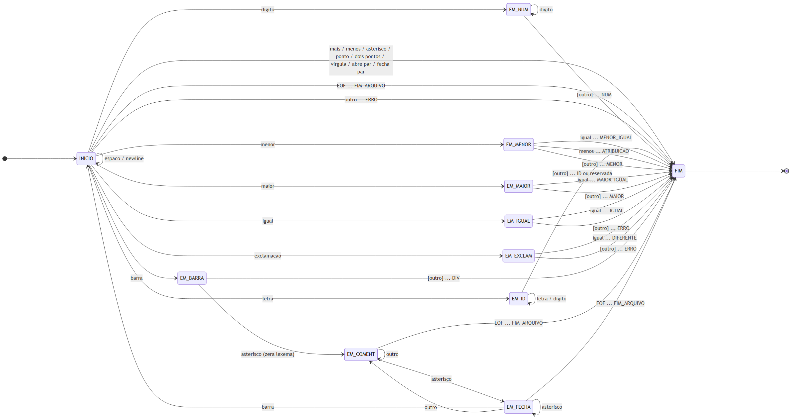

```{=openxml}
<w:p><w:pPr><w:ind w:firstLine="0"/><w:jc w:val="center"/><w:rPr><w:b/><w:sz w:val="32"/><w:szCs w:val="32"/></w:rPr></w:pPr><w:r><w:rPr><w:b/><w:sz w:val="32"/><w:szCs w:val="32"/></w:rPr><w:t xml:space="preserve">UNIVERSIDADE VEIGA DE ALMEIDA – UVA</w:t></w:r></w:p>
<w:p><w:pPr><w:ind w:firstLine="0"/><w:jc w:val="center"/></w:pPr></w:p>
<w:p><w:pPr><w:ind w:firstLine="0"/><w:jc w:val="center"/><w:rPr><w:b/><w:sz w:val="32"/><w:szCs w:val="32"/></w:rPr></w:pPr><w:r><w:rPr><w:b/><w:sz w:val="32"/><w:szCs w:val="32"/></w:rPr><w:t xml:space="preserve">BACHARELADO EM CIÊNCIA DA COMPUTAÇÃO</w:t></w:r></w:p>
<w:p><w:pPr><w:ind w:firstLine="0"/><w:jc w:val="center"/></w:pPr></w:p>
<w:p><w:pPr><w:ind w:firstLine="0"/><w:jc w:val="center"/></w:pPr></w:p>
<w:p><w:pPr><w:ind w:firstLine="0"/><w:jc w:val="center"/></w:pPr></w:p>
<w:p><w:pPr><w:ind w:firstLine="0"/><w:jc w:val="center"/></w:pPr></w:p>
<w:p><w:pPr><w:ind w:firstLine="0"/><w:jc w:val="center"/></w:pPr></w:p>
<w:p><w:pPr><w:ind w:firstLine="0"/><w:jc w:val="center"/></w:pPr></w:p>
<w:p><w:pPr><w:ind w:firstLine="0"/><w:jc w:val="center"/></w:pPr></w:p>
<w:p><w:pPr><w:ind w:firstLine="0"/><w:jc w:val="center"/></w:pPr></w:p>
<w:p><w:pPr><w:ind w:firstLine="0"/><w:jc w:val="center"/><w:rPr><w:b/><w:sz w:val="28"/><w:szCs w:val="28"/></w:rPr></w:pPr><w:r><w:rPr><w:b/><w:sz w:val="28"/><w:szCs w:val="28"/></w:rPr><w:t xml:space="preserve">ANALISADOR LÉXICO DA LINGUAGEM DOMUS</w:t></w:r></w:p>
<w:p><w:pPr><w:ind w:firstLine="0"/><w:jc w:val="center"/></w:pPr></w:p>
<w:p><w:pPr><w:ind w:firstLine="0"/><w:jc w:val="center"/></w:pPr></w:p>
<w:p><w:pPr><w:ind w:firstLine="0"/><w:jc w:val="center"/></w:pPr></w:p>
<w:p><w:pPr><w:ind w:firstLine="0"/><w:jc w:val="center"/></w:pPr></w:p>
<w:p><w:pPr><w:ind w:firstLine="0"/><w:jc w:val="center"/></w:pPr></w:p>
<w:p><w:pPr><w:ind w:firstLine="0"/><w:jc w:val="center"/><w:rPr><w:b/><w:sz w:val="28"/><w:szCs w:val="28"/></w:rPr></w:pPr><w:r><w:rPr><w:b/><w:sz w:val="28"/><w:szCs w:val="28"/></w:rPr><w:t xml:space="preserve">CAIO PARADA OLIVEIRA PLANINSCHEK - 1240205596</w:t></w:r></w:p>
<w:p><w:pPr><w:ind w:firstLine="0"/><w:jc w:val="center"/></w:pPr></w:p>
<w:p><w:pPr><w:ind w:firstLine="0"/><w:jc w:val="center"/></w:pPr></w:p>
<w:p><w:pPr><w:ind w:firstLine="0"/><w:jc w:val="center"/></w:pPr></w:p>
<w:p><w:pPr><w:ind w:firstLine="0"/><w:jc w:val="center"/></w:pPr></w:p>
<w:p><w:pPr><w:ind w:firstLine="0"/><w:jc w:val="center"/></w:pPr></w:p>
<w:p><w:pPr><w:ind w:firstLine="0"/><w:jc w:val="center"/></w:pPr></w:p>
<w:p><w:pPr><w:ind w:firstLine="0"/><w:jc w:val="center"/></w:pPr></w:p>
<w:p><w:pPr><w:ind w:firstLine="0"/><w:jc w:val="center"/></w:pPr></w:p>
<w:p><w:pPr><w:ind w:firstLine="0"/><w:jc w:val="center"/><w:rPr><w:b/><w:sz w:val="24"/><w:szCs w:val="24"/></w:rPr></w:pPr><w:r><w:rPr><w:b/><w:sz w:val="24"/><w:szCs w:val="24"/></w:rPr><w:t xml:space="preserve">RIO DE JANEIRO</w:t></w:r></w:p>
<w:p><w:pPr><w:ind w:firstLine="0"/><w:jc w:val="center"/></w:pPr></w:p>
<w:p><w:pPr><w:ind w:firstLine="0"/><w:jc w:val="center"/><w:rPr><w:b/><w:sz w:val="24"/><w:szCs w:val="24"/></w:rPr></w:pPr><w:r><w:rPr><w:b/><w:sz w:val="24"/><w:szCs w:val="24"/></w:rPr><w:t xml:space="preserve">2026</w:t></w:r></w:p>
<w:p><w:pPr><w:pageBreakBefore/><w:ind w:firstLine="0"/><w:jc w:val="center"/><w:rPr><w:b/><w:sz w:val="28"/><w:szCs w:val="28"/></w:rPr></w:pPr><w:r><w:rPr><w:b/><w:sz w:val="28"/><w:szCs w:val="28"/></w:rPr><w:t xml:space="preserve">CAIO PARADA OLIVEIRA PLANINSCHEK - 1240205596</w:t></w:r></w:p>
<w:p><w:pPr><w:ind w:firstLine="0"/><w:jc w:val="center"/></w:pPr></w:p>
<w:p><w:pPr><w:ind w:firstLine="0"/><w:jc w:val="center"/></w:pPr></w:p>
<w:p><w:pPr><w:ind w:firstLine="0"/><w:jc w:val="center"/></w:pPr></w:p>
<w:p><w:pPr><w:ind w:firstLine="0"/><w:jc w:val="center"/></w:pPr></w:p>
<w:p><w:pPr><w:ind w:firstLine="0"/><w:jc w:val="center"/></w:pPr></w:p>
<w:p><w:pPr><w:ind w:firstLine="0"/><w:jc w:val="center"/></w:pPr></w:p>
<w:p><w:pPr><w:ind w:firstLine="0"/><w:jc w:val="center"/></w:pPr></w:p>
<w:p><w:pPr><w:ind w:firstLine="0"/><w:jc w:val="center"/><w:rPr><w:b/><w:sz w:val="28"/><w:szCs w:val="28"/></w:rPr></w:pPr><w:r><w:rPr><w:b/><w:sz w:val="28"/><w:szCs w:val="28"/></w:rPr><w:t xml:space="preserve">ANALISADOR LÉXICO DA LINGUAGEM DOMUS</w:t></w:r></w:p>
<w:p><w:pPr><w:ind w:firstLine="0"/><w:jc w:val="center"/></w:pPr></w:p>
<w:p><w:pPr><w:ind w:firstLine="0"/><w:jc w:val="center"/></w:pPr></w:p>
<w:p><w:pPr><w:ind w:firstLine="0"/><w:jc w:val="center"/></w:pPr></w:p>
<w:p><w:pPr><w:spacing w:line="240" w:lineRule="auto"/><w:ind w:left="4536" w:firstLine="0"/><w:jc w:val="both"/><w:rPr><w:sz w:val="24"/><w:szCs w:val="24"/></w:rPr></w:pPr><w:r><w:rPr><w:sz w:val="24"/><w:szCs w:val="24"/></w:rPr><w:t xml:space="preserve">Relatório do Trabalho 1 apresentado como parte da avaliação A1 do componente curricular Compiladores do Curso de Ciência da Computação da Universidade Veiga de Almeida.</w:t></w:r></w:p>
<w:p><w:pPr><w:ind w:firstLine="0"/><w:jc w:val="center"/></w:pPr></w:p>
<w:p><w:pPr><w:spacing w:line="240" w:lineRule="auto"/><w:ind w:left="4536" w:firstLine="0"/><w:jc w:val="both"/><w:rPr><w:sz w:val="24"/><w:szCs w:val="24"/></w:rPr></w:pPr><w:r><w:rPr><w:sz w:val="24"/><w:szCs w:val="24"/></w:rPr><w:t xml:space="preserve">Professor: Fábio Contarini Carneiro</w:t></w:r></w:p>
<w:p><w:pPr><w:spacing w:line="240" w:lineRule="auto"/><w:ind w:left="4536" w:firstLine="0"/><w:jc w:val="both"/><w:rPr><w:sz w:val="24"/><w:szCs w:val="24"/></w:rPr></w:pPr><w:r><w:rPr><w:sz w:val="24"/><w:szCs w:val="24"/></w:rPr><w:t xml:space="preserve">Semestre: 2026.2</w:t></w:r></w:p>
<w:p><w:pPr><w:ind w:firstLine="0"/><w:jc w:val="center"/></w:pPr></w:p>
<w:p><w:pPr><w:ind w:firstLine="0"/><w:jc w:val="center"/></w:pPr></w:p>
<w:p><w:pPr><w:ind w:firstLine="0"/><w:jc w:val="center"/></w:pPr></w:p>
<w:p><w:pPr><w:ind w:firstLine="0"/><w:jc w:val="center"/></w:pPr></w:p>
<w:p><w:pPr><w:ind w:firstLine="0"/><w:jc w:val="center"/></w:pPr></w:p>
<w:p><w:pPr><w:ind w:firstLine="0"/><w:jc w:val="center"/></w:pPr></w:p>
<w:p><w:pPr><w:ind w:firstLine="0"/><w:jc w:val="center"/><w:rPr><w:b/><w:sz w:val="24"/><w:szCs w:val="24"/></w:rPr></w:pPr><w:r><w:rPr><w:b/><w:sz w:val="24"/><w:szCs w:val="24"/></w:rPr><w:t xml:space="preserve">RIO DE JANEIRO</w:t></w:r></w:p>
<w:p><w:pPr><w:ind w:firstLine="0"/><w:jc w:val="center"/></w:pPr></w:p>
<w:p><w:pPr><w:ind w:firstLine="0"/><w:jc w:val="center"/><w:rPr><w:b/><w:sz w:val="24"/><w:szCs w:val="24"/></w:rPr></w:pPr><w:r><w:rPr><w:b/><w:sz w:val="24"/><w:szCs w:val="24"/></w:rPr><w:t xml:space="preserve">2026</w:t></w:r></w:p>
<w:p><w:pPr><w:keepNext/><w:pageBreakBefore/><w:spacing w:after="360"/><w:ind w:firstLine="0"/><w:jc w:val="center"/><w:rPr><w:b/><w:sz w:val="28"/><w:szCs w:val="28"/></w:rPr></w:pPr><w:r><w:rPr><w:b/><w:sz w:val="28"/><w:szCs w:val="28"/></w:rPr><w:t xml:space="preserve">RESUMO</w:t></w:r></w:p>
```

Este relatório documenta a construção de um analisador léxico para a linguagem Domus, uma linguagem voltada à descrição de sensores e atuadores em ambientes automatizados. O analisador foi implementado manualmente na linguagem C, sem o uso de gerador automático, a partir de um autômato finito determinístico de onze estados derivado das definições regulares da linguagem. O programa lê o código-fonte de um arquivo externo, informado na linha de comando, e expõe a função `getToken`, chamada repetidamente até que o fim do arquivo seja alcançado; para cada token reconhecido são exibidos o número da linha em que ocorreu, a sua categoria e, quando existe, o seu valor. A linguagem possui trinta e três tipos de token, distribuídos entre treze palavras reservadas, dezesseis símbolos especiais, dois tokens multicaractere e dois tokens de controle. A estratégia de implementação segue a estrutura de varredura apresentada por Louden e adotada no material da disciplina: um laço sobre os caracteres do arquivo com um comando `switch` duplamente aninhado, no qual o nível externo representa o estado corrente do autômato e o nível interno decide a transição. O reconhecimento da maior subcadeia possível é obtido pela leitura de um caractere de verificação à frente, devolvido à entrada quando não pertence ao token. As palavras reservadas não recebem estados próprios: são reconhecidas como identificador e reclassificadas por consulta a uma tabela. O analisador foi validado contra cinco arquivos de teste, entre eles os três distribuídos pelo professor, e a sua saída foi comparada com a do analisador de referência da disciplina.

Palavras-chave: compiladores; análise léxica; autômato finito determinístico; linguagem Domus; linguagem C.

```{=openxml}
<w:p><w:pPr><w:keepNext/><w:pageBreakBefore/><w:spacing w:after="360"/><w:ind w:firstLine="0"/><w:jc w:val="center"/><w:rPr><w:b/><w:sz w:val="28"/><w:szCs w:val="28"/></w:rPr></w:pPr><w:r><w:rPr><w:b/><w:sz w:val="28"/><w:szCs w:val="28"/></w:rPr><w:t xml:space="preserve">SUMÁRIO</w:t></w:r></w:p>
<w:p><w:pPr><w:pStyle w:val="Sumrio1"/><w:ind w:firstLine="0"/></w:pPr><w:r><w:fldChar w:fldCharType="begin" w:dirty="true"/></w:r><w:r><w:instrText xml:space="preserve"> TOC \o "1-3" \h \z \u </w:instrText></w:r><w:r><w:fldChar w:fldCharType="separate"/></w:r><w:r><w:t xml:space="preserve">Atualize este campo no Word: Ctrl+A e depois F9.</w:t></w:r><w:r><w:fldChar w:fldCharType="end"/></w:r></w:p>
<w:p><w:pPr><w:spacing w:after="0" w:line="240" w:lineRule="auto"/><w:rPr><w:sz w:val="2"/><w:szCs w:val="2"/></w:rPr><w:sectPr><w:type w:val="nextPage"/><w:pgSz w:code="9" w:h="16838" w:w="11906"/><w:pgMar w:bottom="1417" w:footer="709" w:gutter="0" w:header="709" w:left="1701" w:right="1133" w:top="1417"/><w:cols w:space="708"/><w:docGrid w:linePitch="360"/></w:sectPr></w:pPr></w:p>
```

# INTRODUÇÃO

A análise léxica é a primeira fase de um compilador. Cabe a ela ler o programa-fonte como uma sequência de caracteres e agrupá-la em unidades com significado próprio, os tokens, que são entregues às fases seguintes. É a fase que separa o problema de reconhecer a forma das palavras da linguagem do problema, muito distinto, de reconhecer a estrutura das frases.

Este trabalho constrói um analisador léxico para a linguagem Domus, cuja especificação foi disponibilizada na disciplina. Domus é uma linguagem de domínio específico voltada à automação de ambientes: seus programas declaram sensores e atuadores associados a portas analógicas ou digitais e descrevem, com estruturas condicionais e de repetição, o comportamento esperado desses dispositivos.

O objetivo geral do trabalho é implementar um programa de varredura que leia um programa-fonte Domus de um arquivo externo e produza, para cada token encontrado, a sua identificação textual, o seu valor quando houver e a linha do programa-fonte em que ele ocorre. Como objetivos específicos, o trabalho se propõe a: descrever formalmente o conjunto de tokens da linguagem por meio de definições regulares; derivar dessas definições um autômato finito determinístico completo; implementar esse autômato diretamente em linguagem C, sem gerador automático e sem bibliotecas externas; e validar o resultado contra os arquivos de teste da disciplina.

A opção pela implementação manual, em vez do uso de um gerador automático como o Flex, foi deliberada. O autômato construído à mão torna explícito o mecanismo que um gerador esconde, o que atende melhor ao propósito formativo da disciplina; além disso, elimina qualquer dependência de ferramenta externa, atendendo à exigência do enunciado de que o código utilize apenas os recursos padrão da linguagem escolhida.

O relatório está organizado da seguinte forma. O capítulo 2 apresenta os lexemas e os tokens da linguagem Domus, com as definições regulares que os descrevem. O capítulo 3 detalha a estratégia adotada no desenvolvimento, incluindo o autômato finito determinístico, a sua tabela de transição e a forma como ele foi transposto para código. O capítulo 4 descreve como compilar e executar o analisador. O capítulo 5 apresenta e discute os resultados obtidos na execução dos programas de teste. O capítulo 6 registra as limitações conhecidas e as decisões de projeto que as motivaram. Por fim, o capítulo 7 apresenta as considerações finais.

# LEXEMAS E TOKENS DA LINGUAGEM DOMUS

Este capítulo apresenta o vocabulário da linguagem Domus. A distinção entre os três conceitos envolvidos é o ponto de partida de toda a análise léxica e vale ser fixada antes das tabelas. O **padrão** é a regra que descreve a forma de uma classe de cadeias; o **lexema** é a cadeia concreta que aparece no programa-fonte e que casa com esse padrão; o **token** é o nome da classe, o símbolo que o analisador léxico devolve ao seu chamador. Na linha `sensor temperatura: analogico(porta 1).`, a cadeia `temperatura` é um lexema, o padrão que ela satisfaz é o de identificador, e o token devolvido é `ID`.

A distinção tem uma consequência prática que orienta todo o restante do capítulo: apenas os tokens cujo lexema varia precisam carregar um valor associado, chamado atributo. Uma palavra reservada tem sempre o mesmo lexema, de modo que o token já o determina por completo; um identificador, não, e por isso o seu nome precisa ser transportado junto do token.

A linguagem possui trinta e três tipos de token, distribuídos em quatro categorias, apresentadas nas seções seguintes.

## Tokens de controle

São dois os tokens que não correspondem a construções escritas pelo programador, mas a condições encontradas durante a varredura.

::: {custom-style="caption"}
Quadro 1: Tokens de controle
:::

| Token | Lexema | Atributo |
|---|---|---|
| `FIM_ARQUIVO` | nenhum; corresponde à condição de fim de entrada | — |
| `ERRO` | qualquer caractere ou sequência não reconhecida | o lexema ofensor |

::: {custom-style="caption"}
Fonte: autor
:::

O token `FIM_ARQUIVO` é o que encerra o laço de varredura do programa principal. O token `ERRO` é devolvido quando o autômato encontra uma cadeia que não pertence à linguagem; a sua ocorrência não interrompe a análise, conforme discutido na seção 5.2.

## Palavras reservadas

A linguagem possui treze palavras reservadas. Todas têm lexema fixo, coincidente com o nome do token, e nenhuma possui atributo.

::: {custom-style="caption"}
Quadro 2: Palavras reservadas da linguagem Domus
:::

| Token | Lexema | Papel na linguagem |
|---|---|---|
| `SENSOR` | `sensor` | declara um dispositivo de leitura |
| `ATUADOR` | `atuador` | declara um dispositivo de acionamento |
| `PORTA` | `porta` | indica a porta física associada ao dispositivo |
| `ANALOGICO` | `analogico` | qualifica a porta como analógica |
| `DIGITAL` | `digital` | qualifica a porta como digital |
| `SE` | `se` | abre um comando condicional |
| `ENTAO` | `entao` | separa a condição do bloco a executar |
| `SENAO` | `senao` | abre o bloco alternativo |
| `FIM_SE` | `fim_se` | encerra o comando condicional |
| `ENQUANTO` | `enquanto` | abre um comando de repetição |
| `FIM_ENQUANTO` | `fim_enquanto` | encerra o comando de repetição |
| `LER` | `ler` | comando de entrada |
| `ESCREVER` | `escrever` | comando de saída |

::: {custom-style="caption"}
Fonte: autor
:::

A comparação entre um lexema e a lista de palavras reservadas é sensível a maiúsculas e minúsculas. A especificação da linguagem lista todas as palavras-chave em minúsculas, e o analisador trata `SENSOR` e `Sensor` como identificadores comuns. A decisão está registrada como tal na seção 6.4.

## Tokens multicaractere

São os únicos tokens cujo lexema varia de ocorrência para ocorrência e, por consequência, os únicos que carregam atributo.

::: {custom-style="caption"}
Quadro 3: Tokens multicaractere
:::

| Token | Padrão | Atributo | Exemplo de lexema |
|---|---|---|---|
| `ID` | identificador | o nome do identificador | `temperatura`, `_sub`, `a1b2` |
| `NUM` | numero | o valor inteiro lido | `1`, `30`, `80` |

::: {custom-style="caption"}
Fonte: autor
:::

## Símbolos especiais

A linguagem possui dezesseis símbolos especiais. Onze deles têm um único caractere e cinco têm dois.

::: {custom-style="caption"}
Quadro 4: Símbolos especiais da linguagem Domus
:::

| Token | Lexema | Token | Lexema |
|---|---|---|---|
| `SOMA` | `+` | `IGUAL` | `==` |
| `SUB` | `-` | `DIFERENTE` | `!=` |
| `MULT` | `*` | `ATRIBUICAO` | `<-` |
| `DIV` | `/` | `PONTO` | `.` |
| `MENOR` | `<` | `DOIS_PONTOS` | `:` |
| `MENOR_IGUAL` | `<=` | `VIRGULA` | `,` |
| `MAIOR` | `>` | `ABRE_PAR` | `(` |
| `MAIOR_IGUAL` | `>=` | `FECHA_PAR` | `)` |

::: {custom-style="caption"}
Fonte: autor
:::

Os cinco símbolos de dois caracteres — `<=`, `>=`, `==`, `!=` e `<-` — são a razão pela qual o autômato precisa de estados intermediários e de um mecanismo de verificação à frente, tratados no capítulo 3. Somando as quatro categorias, a linguagem totaliza 2 + 13 + 2 + 16 = 33 tipos de token.

## Definições regulares

As classes de cadeia reconhecidas pelo analisador são descritas pelas definições regulares a seguir.

```
digito        = [0-9]
letra         = [a-zA-Z_]
numero        = digito digito*
identificador = letra ( letra | digito )*
espaco        = [ \t\r]+
newline       = \n
comentario    = "/*" ( qualquer caractere )* "*/"
```

Três observações sobre essas definições merecem destaque, porque cada uma delas tem consequência direta sobre o código.

A primeira é que o caractere de sublinhado pertence à classe *letra*, e não é uma concessão cosmética. Duas das treze palavras reservadas, `fim_se` e `fim_enquanto`, contêm o sublinhado. Se ele ficasse fora da classe *letra*, `fim_se` seria lido como três unidades — o identificador `fim`, um erro léxico no `_` e a palavra reservada `se` — e a linguagem deixaria de ser reconhecível. Como a função `isalpha` da biblioteca padrão de C responde falso para o sublinhado, o analisador implementa a classe em uma função própria, e não pela chamada direta à biblioteca.

A segunda é que a definição de *numero* não prevê sinal. Não existe produção para `+` ou `-` dentro de um número, de modo que na entrada `asd - 1` o traço é sempre o operador de subtração e nunca parte do literal. Interpretar uma sequência como um valor negativo é decisão do analisador sintático, que dispõe do contexto necessário para isso; o analisador léxico não dispõe.

A terceira é que os comentários não são aninhados e podem atravessar linhas. A sequência `/* a /* b */` termina no primeiro `*/` que encontra, e o `/*` interno é tratado como texto comum. O conteúdo do comentário é integralmente descartado, mas as mudanças de linha ocorridas dentro dele continuam sendo contadas, de modo que o token seguinte ao comentário é reportado na linha correta.

Por fim, o espaço em branco é separador e nada mais: é descartado, servindo apenas para delimitar identificadores, números e palavras reservadas. O retorno de carro foi incluído na classe *espaco* para que arquivos-fonte gravados com terminação de linha CRLF sejam analisados corretamente também fora do ambiente Windows.

# ESTRATÉGIA ADOTADA

Este capítulo descreve como as definições regulares do capítulo anterior foram convertidas em um programa. O percurso tem quatro etapas: a construção de um autômato finito determinístico que reconheça as classes de cadeia da linguagem; a definição da sua tabela de transição; a transposição direta dessa tabela para código, por meio de um comando `switch` duplamente aninhado; e o tratamento dos dois pontos em que o reconhecimento da maior subcadeia possível exige olhar um caractere à frente.

## O autômato finito determinístico

O autômato construído possui onze estados. Um deles é o estado inicial, um é o estado final, e os nove restantes representam situações em que o analisador já leu parte de um token mas ainda não sabe qual token é.

::: {custom-style="caption"}
Quadro 5: Estados do autômato
:::

| Estado | Papel |
|---|---|
| `INICIO` | estado inicial; descarta espaço em branco e decide a classe do próximo token |
| `EM_NUM` | acumulando os dígitos de um número |
| `EM_ID` | acumulando um identificador ou palavra reservada |
| `EM_MENOR` | leu `<`; decide entre `<`, `<=` e `<-` |
| `EM_MAIOR` | leu `>`; decide entre `>` e `>=` |
| `EM_IGUAL` | leu `=`; decide entre `==` e erro |
| `EM_EXCLAM` | leu `!`; decide entre `!=` e erro |
| `EM_BARRA` | leu `/`; decide entre o operador de divisão e a abertura de comentário |
| `EM_COMENT` | dentro de um comentário, descartando caracteres |
| `EM_FECHA` | dentro de um comentário, leu `*`; verifica se o comentário fecha |
| `FIM` | estado final; um token foi reconhecido e é devolvido ao chamador |

::: {custom-style="caption"}
Fonte: autor
:::

Os cinco estados intermediários `EM_MENOR`, `EM_MAIOR`, `EM_IGUAL`, `EM_EXCLAM` e `EM_BARRA` existem por um único motivo: ao ler um `<`, o analisador ainda não sabe se está diante do operador de comparação, do operador de atribuição `<-` ou do operador `<=`. A decisão só pode ser tomada depois de ler o caractere seguinte. Os dois estados `EM_COMENT` e `EM_FECHA` implementam o descarte de comentários, e o segundo é necessário porque o fechamento `*/` também tem dois caracteres.

Na Figura 1 é apresentado o diagrama de estados completo do autômato. Os colchetes marcam as transições em que o caractere lido não pertence ao token e é devolvido à entrada, e as reticências separam a condição da transição do token reconhecido.

{width=15.5cm}

::: {custom-style="caption"}
Figura 1: Autômato finito determinístico do analisador léxico da linguagem Domus
:::

::: {custom-style="caption"}
Fonte: autor
:::

## Tabela de transição

O Quadro 6 apresenta as transições do autômato. Para mantê-lo legível, as classes de caractere que produzem o mesmo efeito em um dado estado foram agrupadas na entrada `demais classes`. A marca `[devolve]` indica que o caractere lido não pertence ao token corrente e retorna à entrada, tornando-se o primeiro caractere da próxima chamada.

::: {custom-style="caption"}
Quadro 6: Transições do autômato
:::

| Estado | Classe de entrada | Próximo estado | Token reconhecido |
|---|---|---|---|
| `INICIO` | `espaco`, `newline` | `INICIO` | — |
| `INICIO` | `digito` | `EM_NUM` | — |
| `INICIO` | `letra` | `EM_ID` | — |
| `INICIO` | `<` | `EM_MENOR` | — |
| `INICIO` | `>` | `EM_MAIOR` | — |
| `INICIO` | `=` | `EM_IGUAL` | — |
| `INICIO` | `!` | `EM_EXCLAM` | — |
| `INICIO` | `/` | `EM_BARRA` | — |
| `INICIO` | `+ - * . : , ( )` | `FIM` | símbolo correspondente |
| `INICIO` | fim de arquivo | `FIM` | `FIM_ARQUIVO` |
| `INICIO` | demais classes | `FIM` | `ERRO` |
| `EM_NUM` | `digito` | `EM_NUM` | — |
| `EM_NUM` | demais classes | `FIM` | `NUM` [devolve] |
| `EM_ID` | `letra`, `digito` | `EM_ID` | — |
| `EM_ID` | demais classes | `FIM` | `ID` ou palavra reservada [devolve] |
| `EM_MENOR` | `=` | `FIM` | `MENOR_IGUAL` |
| `EM_MENOR` | `-` | `FIM` | `ATRIBUICAO` |
| `EM_MENOR` | demais classes | `FIM` | `MENOR` [devolve] |
| `EM_MAIOR` | `=` | `FIM` | `MAIOR_IGUAL` |
| `EM_MAIOR` | demais classes | `FIM` | `MAIOR` [devolve] |
| `EM_IGUAL` | `=` | `FIM` | `IGUAL` |
| `EM_IGUAL` | demais classes | `FIM` | `ERRO` [devolve] |
| `EM_EXCLAM` | `=` | `FIM` | `DIFERENTE` |
| `EM_EXCLAM` | demais classes | `FIM` | `ERRO` [devolve] |
| `EM_BARRA` | `*` | `EM_COMENT` | — (descarta o lexema acumulado) |
| `EM_BARRA` | demais classes | `FIM` | `DIV` [devolve] |
| `EM_COMENT` | `*` | `EM_FECHA` | — |
| `EM_COMENT` | fim de arquivo | `FIM` | `FIM_ARQUIVO` |
| `EM_COMENT` | demais classes | `EM_COMENT` | — |
| `EM_FECHA` | `/` | `INICIO` | — |
| `EM_FECHA` | `*` | `EM_FECHA` | — |
| `EM_FECHA` | fim de arquivo | `FIM` | `FIM_ARQUIVO` |
| `EM_FECHA` | demais classes | `EM_COMENT` | — |

::: {custom-style="caption"}
Fonte: autor
:::

O autômato é total: em todo estado, toda classe de caractere possui destino definido. Nenhuma entrada, por mais inesperada que seja, é capaz de travar o analisador ou levá-lo a um estado indefinido.

Duas células merecem comentário. A primeira é a transição de `EM_FECHA` com `*` de volta para o próprio `EM_FECHA`. Permanecer no mesmo estado é o que faz um comentário terminado em `***/` fechar corretamente: cada asterisco adicional mantém viva a possibilidade de o próximo caractere ser a barra. A segunda é a transição de `EM_BARRA` com `*` para `EM_COMENT`, que descarta o lexema acumulado. A barra havia sido guardada quando o analisador ainda não sabia se era divisão ou abertura de comentário; confirmado o comentário, ela precisa ser descartada, sob pena de vazar para o início do token seguinte.

## Estrutura do código: o *switch* duplamente aninhado

A implementação transpõe a tabela do Quadro 6 diretamente para código, seguindo a estrutura de varredura empregada por Louden (2004) e adotada no material da disciplina. A função `getToken` contém um laço que consome um caractere por iteração e, dentro dele, um comando `switch` sobre o estado corrente do autômato; dentro de cada caso, uma segunda decisão trata a classe do caractere lido. O nível externo corresponde às linhas da tabela de transição e o nível interno às suas colunas.

O esqueleto da função é o seguinte:

```
TokenType getToken(void)
{
    int tokenStringIndex = 0;
    TokenType currentToken = ERRO;
    StateType estado = INICIO;
    int save;

    while (estado != FIM) {
        int c = getNextChar();
        save = TRUE;
        switch (estado) {

        case INICIO:
            if (ehDigito(c))
                estado = EM_NUM;
            else if (ehLetra(c))
                estado = EM_ID;
            ...
            break;

        case EM_NUM:
            if (!ehDigito(c)) {
                devolveCaractere();
                save = FALSE;
                estado = FIM;
                currentToken = NUM;
            }
            break;
        ...
        }

        if (save && (tokenStringIndex < MAXTOKENLEN))
            tokenString[tokenStringIndex++] = (char) c;

        if (estado == FIM) {
            tokenString[tokenStringIndex] = '\0';
            if (currentToken == ID)
                currentToken = reservedLookup(tokenString);
        }
    }
    ...
}
```

A variável `save` merece atenção porque concentra uma decisão que o autômato do Quadro 6 expressa apenas implicitamente: nem todo caractere lido pertence ao lexema. O espaço em branco descartado no estado `INICIO`, os caracteres consumidos dentro de um comentário e o caractere de verificação à frente devolvido à entrada são todos lidos, mas nenhum deles é acumulado. Concentrar essa decisão em uma única variável, testada em um único ponto ao final do laço, evita espalhar a lógica de acumulação por todos os casos do `switch`.

A vantagem dessa organização é a correspondência linha a linha entre o autômato e o programa. Um estado do autômato é um `case`; uma transição é uma atribuição a `estado`. Quando o autômato precisa mudar, o ponto exato a alterar no código é imediato, e a verificação de que a implementação corresponde ao projeto é feita por leitura direta, sem intermediários.

## O caractere de verificação à frente

O analisador reconhece sempre a maior subcadeia possível. Diante de `<=`, deve devolver o token `MENOR_IGUAL` e não o token `MENOR` seguido de um erro. Isso obriga, em vários estados, a ler um caractere a mais do que o token efetivamente contém.

Esse caractere excedente é o caractere de verificação à frente. Ele não pertence ao token que está sendo reconhecido e precisa ser devolvido à entrada, de modo a ser o primeiro caractere lido na chamada seguinte. A devolução é feita retrocedendo uma posição no buffer da linha corrente.

O efeito é observável em entradas sem espaço entre os tokens. Na entrada `a=b.`, o estado `EM_ID` lê o `=` para descobrir que o identificador `a` terminou; sem a devolução, o `=` seria perdido. Com ela, a saída produz o identificador `a`, um erro léxico no `=` isolado, o identificador `b` e o símbolo `.` — nenhum caractere se perde.

Há um caso em que a devolução precisa ser suprimida: o fim do arquivo. Não existe caractere a devolver quando o que encerrou o token foi o fim da entrada, e retroceder ali levaria a posição de leitura para fora do buffer. O analisador mantém, por isso, uma marca de fim de arquivo consultada antes de cada devolução.

## Palavras reservadas fora do autômato

As treze palavras reservadas casam com exatamente a mesma expressão regular dos identificadores. Dar a cada uma delas um caminho próprio no autômato multiplicaria os estados sem nenhum ganho de reconhecimento: `sensor` exigiria uma cadeia de seis estados, `fim_enquanto` uma de doze, e o autômato de onze estados passaria de setenta.

A estratégia adotada é a convencional. O autômato reconhece a cadeia como identificador e, no momento em que alcança o estado `FIM`, uma consulta a uma tabela de treze pares decide se o token é de fato um identificador ou a palavra reservada correspondente. O custo é uma comparação linear sobre treze cadeias, executada apenas quando um identificador é concluído.

```
static TokenType reservedLookup(char *s)
{
    int i;
    for (i = 0; i < MAXRESERVED; i++)
        if (!strcmp(s, reservedWords[i].str))
            return reservedWords[i].tok;
    return ID;
}
```

## Organização dos arquivos

O código está distribuído em seis arquivos, na mesma organização do analisador da linguagem TINY distribuído na disciplina. A separação isola o autômato, que é a parte específica de Domus, das partes que não dependem da linguagem.

::: {custom-style="caption"}
Quadro 7: Arquivos do código-fonte
:::

| Arquivo | Conteúdo |
|---|---|
| `globals.h` | tipos e variáveis globais; a enumeração dos 33 tokens |
| `scan.h` | interface do analisador: a declaração de `getToken` e do lexema corrente |
| `scan.c` | implementação do autômato; leitura do arquivo e devolução de caractere |
| `util.h` | interface do utilitário de impressão |
| `util.c` | impressão da categoria e do lexema de cada token |
| `main.c` | programa de teste; abre o arquivo e chama `getToken` até o fim |

::: {custom-style="caption"}
Fonte: autor
:::

A enumeração `TokenType`, declarada em `globals.h`, é o contrato entre o analisador léxico e o restante do compilador. Manter esse contrato em um tipo próprio, e não em constantes espalhadas, é o que permitirá ligar `getToken` a um analisador sintático em trabalhos posteriores sem alterar o código da varredura.

O programa principal reduz-se ao laço exigido pelo enunciado:

```
    /* getToken e chamada repetidamente ate alcancar o fim do arquivo. */
    do {
        token = getToken();
    } while (token != FIM_ARQUIVO);
```

# COMPILAÇÃO E EXECUÇÃO

O analisador é escrito em C padrão e não depende de bibliotecas externas, de ambiente de desenvolvimento ou de qualquer ferramenta além de um compilador C. Foi desenvolvido e testado com o compilador GCC versão 6.3.0, da distribuição MinGW, em ambiente Windows.

## Compilação

A partir do diretório `src`, a compilação é feita por uma única linha de comando:

```
gcc -Wall -ansi -pedantic -o analisador_domus.exe main.c scan.c util.c
```

As três opções foram usadas durante todo o desenvolvimento e não são acessórias. A opção `-Wall` habilita o conjunto amplo de advertências do compilador; `-ansi` exige conformidade com o padrão C89; e `-pedantic` recusa as extensões do compilador que o padrão não prevê. A compilação do código entregue não emite nenhuma advertência sob essas três opções.

Em sistemas do tipo Unix, o mesmo comando produz o executável, bastando substituir o nome do arquivo de saída por `analisador_domus`.

## Execução

O analisador recebe o caminho do programa-fonte como único argumento da linha de comando:

```
analisador_domus arquivo.txt
```

A saída é escrita na saída padrão, o que permite redirecioná-la a um arquivo pelos recursos do próprio interpretador de comandos:

```
analisador_domus arquivo.txt > saida.txt
```

Cada linha da saída tem o formato a seguir, no qual o número da linha do programa-fonte ocupa cinco colunas alinhadas à direita:

```
<linha do programa fonte>: <categoria do token>: <lexema>
```

O Quadro 8 relaciona cada categoria de token à linha que ela produz.

::: {custom-style="caption"}
Quadro 8: Formato da saída por categoria de token
:::

| Categoria | Linha impressa |
|---|---|
| palavras reservadas (13) | `palavra reservada: <lexema>` |
| identificador | `identificador: <nome>` |
| número | `numero: <valor>` |
| símbolos especiais (16) | `simbolo: <lexema>` |
| erro léxico | `ERRO: lexema encontrado: <lexema>` |
| fim de arquivo | `fim de arquivo` |

::: {custom-style="caption"}
Fonte: autor
:::

O programa devolve o código de saída zero quando a análise se completa. Devolve o código um, com mensagem na saída de erro padrão, em duas situações: quando o número de argumentos é diferente de um e quando o arquivo informado não pode ser aberto.

```
Uso: analisador_domus arquivo_fonte
Erro ao abrir arquivo: "naoexiste.txt"
```

# RESULTADOS DA EXECUÇÃO

O analisador foi executado sobre cinco arquivos de teste. Três deles — `teste.txt`, `erros.txt` e `ExemploDomus.txt` — foram distribuídos pelo professor junto com o material da disciplina. Os outros dois foram construídos para este trabalho: `cobertura.txt`, que exercita os casos que os arquivos do professor não alcançam, e `vazio.txt`, um arquivo de zero byte. As saídas completas das cinco execuções acompanham a entrega, no diretório `testes`.

## Programa de teste funcional

O arquivo `teste.txt` contém um programa Domus sem erros, com vinte e quatro linhas. A execução produz noventa e oito linhas de saída e nenhum erro léxico. As primeiras linhas da saída são:

```
    2: palavra reservada: sensor
    2: identificador: temperatura
    2: simbolo: :
    2: palavra reservada: analogico
    2: simbolo: (
    2: palavra reservada: porta
    2: numero: 1
    2: simbolo: )
    2: simbolo: .
```

Três resultados podem ser observados já neste trecho. O primeiro é que a linha 1 do programa-fonte não produz nenhum token: ela contém apenas o comentário `/* Programa de teste */`, integralmente descartado. O segundo é que `porta` é corretamente classificada como palavra reservada, e não como identificador, apesar de ter sido reconhecida pelo mesmo caminho do autômato que um identificador percorreria — é a consulta à tabela de palavras reservadas em ação. O terceiro é que o número `1` é exibido com o seu valor, e não apenas com a sua categoria, atendendo à exigência do enunciado de que sejam exibidos o token e o seu valor quando houver.

O tratamento de comentários de múltiplas linhas é verificado no trecho seguinte. As linhas 4 a 7 do arquivo contêm um comentário que atravessa quatro linhas, e a linha 8 contém a declaração seguinte:

```
    3: simbolo: .
    8: palavra reservada: atuador
    8: identificador: cortina
```

O salto direto da linha 3 para a linha 8 confirma os dois comportamentos esperados ao mesmo tempo: o conteúdo do comentário foi descartado por completo e, ainda assim, as quatro mudanças de linha ocorridas dentro dele foram contadas, de modo que o token seguinte é reportado na linha 8, que é onde ele de fato está.

A última linha da saída é `24: fim de arquivo`, e o arquivo tem exatamente vinte e quatro linhas.

## Programa de teste com erros

O arquivo `erros.txt` tem vinte e uma linhas e foi distribuído com o propósito de exercitar o tratamento de erros. A execução produz cento e quatro linhas de saída, entre elas exatamente duas ocorrências de erro léxico:

```
   13: ERRO: lexema encontrado: %
   20: ERRO: lexema encontrado: =
```

O primeiro erro está na linha 13, `mod <- 4 % 3.`. O caractere `%` não pertence ao alfabeto da linguagem Domus: não é letra, não é dígito, não é nenhum dos dezesseis símbolos especiais. O autômato o encontra no estado `INICIO`, cai na classe residual da tabela de transição e devolve o token `ERRO` carregando o caractere ofensor como lexema.

O segundo erro está na linha 20, `asd = asd -1.`. Aqui o caractere `=` é, isoladamente, um erro: a linguagem possui o operador de igualdade `==` e o operador de atribuição `<-`, mas não possui o `=` sozinho. O autômato lê o `=` e transita para o estado `EM_IGUAL`, na expectativa de um segundo `=`; encontrando um espaço, devolve o token `ERRO` e devolve o espaço à entrada.

O ponto central deste arquivo, contudo, está no que ele **não** produz. As linhas 6, 8 e 15 contêm três problemas evidentes:

```
 6  se (((temperatura < 30))
 8      ventiladora <- 80.
15  asd <- 8
```

Na linha 6 falta um parêntese de fechamento; na linha 15 falta o ponto final que encerra o comando; na linha 8 aparece `ventiladora`, um identificador nunca declarado, com toda a aparência de ser um erro de digitação de `ventilador`. Nenhum dos três é reportado pelo analisador, e isso é correto.

Nenhum deles é um erro léxico. `se`, `(`, `(`, `(`, `temperatura`, `<`, `30`, `)` e `)` é uma sequência de nove tokens perfeitamente válidos da linguagem, e o analisador léxico não conhece a regra que exige o balanceamento dos parênteses; essa regra pertence à gramática, e o seu descumprimento é um erro sintático, detectável apenas pela fase seguinte. O mesmo vale para o ponto ausente na linha 15. Quanto a `ventiladora`, é um identificador léxicamente irrepreensível, e verificar se ele foi declarado exige uma tabela de símbolos e o conceito de escopo — instrumentos da análise semântica, não da léxica.

A distinção não é um detalhe de implementação, mas a razão de ser da separação em fases. Cada fase reconhece apenas a classe de erro que a sua formalização é capaz de expressar. Uma expressão regular não consegue exigir que parênteses estejam balanceados, e a análise léxica está limitada ao que expressões regulares expressam.

## Casos de cobertura adicional

O arquivo `cobertura.txt` foi escrito para exercitar as construções que os arquivos do professor não alcançam. Ele cobre os cinco símbolos de dois caracteres (`<=`, `>=`, `==`, `!=` e `<-`), identificadores iniciados por sublinhado (`_sub`) e contendo dígitos (`a1b2`), a distinção entre a palavra reservada `fim_se` e a sequência `fim se`, o `!` isolado como erro léxico, o comentário não aninhado `/* c1 /* c2 */` e o comentário sem fechamento.

Dois resultados desse arquivo confirmam pontos delicados do projeto. O primeiro é a linha 16, `fim_se fim se`, que produz três tokens distintos — a palavra reservada `fim_se`, o identificador `fim` e a palavra reservada `se` —, demonstrando que a inclusão do sublinhado na classe *letra* está correta e que o princípio da maior subcadeia está sendo aplicado. O segundo é a linha 18, `/* c1 /* c2 */ b <- 2 .`, cujos tokens `b`, `<-`, `2` e `.` são reconhecidos normalmente: o comentário terminou no primeiro `*/`, como a especificação determina, e não no segundo.

O arquivo termina, propositalmente, com um comentário sem fechamento na linha 19. As linhas seguintes são engolidas por esse comentário e não produzem nenhum token — comportamento discutido na seção 6.1.

## Arquivo vazio

O arquivo `vazio.txt` tem zero byte. A execução produz uma única linha:

```
    0: fim de arquivo
```

O número de linha zero é o resultado correto, e não um efeito colateral: nenhuma linha chegou a ser lida, de modo que o contador nunca saiu do seu valor inicial. O analisador não trata o arquivo vazio como um caso especial em parte alguma do código; ele simplesmente encontra o fim da entrada na primeira tentativa de leitura.

## Comparação com o analisador de referência da disciplina

Junto ao material da disciplina foi distribuído um executável de exemplo, `Domus_lexico.exe`, que implementa um analisador léxico para a mesma linguagem. Ele foi usado como referência de validação: os cinco arquivos de teste foram submetidos aos dois analisadores e as saídas comparadas linha a linha.

A comparação foi feita sobre as saídas normalizadas, isto é, desconsiderando as duas diferenças deliberadas de formato descritas nas seções 6.2 e 6.3. Nessas condições, a diferença entre as duas saídas é **vazia nos cinco arquivos**: mesma sequência de tokens, mesmas categorias, mesmos lexemas e mesmos números de linha, incluindo os arquivos que exercitam comentários de múltiplas linhas, símbolos de dois caracteres e erros léxicos.

# LIMITAÇÕES E DECISÕES DE PROJETO

Este capítulo registra os limites conhecidos do analisador e as decisões que os produziram. Algumas são limitações herdadas do comportamento definido para a linguagem; outras são escolhas feitas neste trabalho, que poderiam ter sido diferentes.

## Comentário sem fechamento

Um comentário aberto com `/*` e nunca fechado consome o restante do arquivo e a análise se encerra normalmente, sem que nenhum erro seja reportado. As linhas seguintes ao `/*` simplesmente não produzem tokens.

O comportamento é observável na tabela de transição: nos estados `EM_COMENT` e `EM_FECHA`, o fim de arquivo leva ao token `FIM_ARQUIVO`, e não ao token `ERRO`. Foi adotado deliberadamente, por ser o comportamento do analisador de referência da disciplina.

É, ainda assim, uma limitação real, e a mais silenciosa de todas as descritas neste capítulo: um `/*` digitado por engano faz o analisador ignorar todo o resto do programa sem emitir nenhum aviso. Uma alternativa defensável seria reportar um erro léxico ao alcançar o fim do arquivo dentro de um comentário, o que exigiria apenas trocar o token devolvido nas duas células citadas.

## Exibição do valor dos números

O enunciado do trabalho determina que, para cada token, sejam exibidos o token e o seu valor ou atributo, quando houver. O analisador desenvolvido exibe, portanto, `numero: 8`, preservando o valor lido.

O executável de referência distribuído com o material imprimia todo número inteiro como `palavra reservada: numero`, descartando o valor e classificando o token em uma categoria à qual ele não pertence — `numero` não consta da lista de palavras-chave da linguagem. Consultado sobre a divergência, o professor confirmou que se tratava de um erro do exemplo e que uma versão corrigida seria disponibilizada. A decisão adotada neste trabalho é, portanto, a que corresponde ao enunciado e à versão corrigida da referência.

## Sinalização do fim do arquivo

O enunciado determina que a função `getToken` seja chamada repetidamente até encontrar o fim do arquivo, informando quando o fim do arquivo for alcançado; a especificação léxica da linguagem, por sua vez, lista "fim de arquivo" entre os componentes léxicos. O analisador desenvolvido imprime, por isso, uma linha final `fim de arquivo`.

O executável de referência não imprimia nada ao alcançar o fim do arquivo. Consultado, o professor esclareceu que a sinalização não é obrigatória, uma vez que o encerramento da análise já indica o fim, mas que exibi-la não constitui problema, e que a versão corrigida da referência passaria a fazê-lo.

## Sensibilidade a maiúsculas e minúsculas

A comparação entre um lexema e a lista de palavras reservadas é sensível a maiúsculas e minúsculas: `SENSOR` e `Sensor` são reconhecidos como identificadores, e não como a palavra reservada `sensor`.

A especificação da linguagem lista todas as palavras-chave em minúsculas, mas não declara explicitamente se a linguagem é sensível ao caso, e o executável de referência não exercita a situação. A decisão seguiu a convenção da linguagem C, na qual a disciplina se apoia, e está registrada aqui por não decorrer diretamente da especificação. Torná-la insensível ao caso exigiria substituir a comparação de cadeias por uma comparação que ignore o caso, sem nenhuma outra alteração no autômato.

## Comprimento máximo da linha

O analisador lê o programa-fonte linha a linha, em um buffer de tamanho fixo de 1024 caracteres. Uma linha mais longa do que isso é dividida em duas leituras, e a contagem de linhas do trecho excedente fica deslocada.

O limite é uma consequência da estratégia de leitura adotada, que é a mesma do analisador da linguagem TINY distribuído na disciplina. Ela foi mantida por manter o código alinhado ao material de referência e por deixar disponível, sem custo adicional, a exibição do programa-fonte junto da saída. Programas Domus reais não se aproximam desse limite.

## Numeração da última linha em arquivos sem quebra de linha final

Quando o arquivo-fonte não termina com uma quebra de linha, o último token do arquivo é reportado com o número da linha seguinte à sua. A causa é que o contador de linhas é incrementado antes da tentativa de leitura, e o caractere de verificação à frente do último token força uma leitura que só então falha.

O deslocamento não afeta a linha do próprio fim de arquivo, que é reportada corretamente: o analisador guarda separadamente o número da última linha efetivamente lida e usa esse valor, e não o contador, ao reportar o token `FIM_ARQUIVO`. O comportamento é idêntico ao do analisador de referência, e os três arquivos de teste distribuídos pelo professor terminam com quebra de linha, de modo que a situação não se manifesta em nenhum deles.

## Escopo da análise

Por fim, e por definição, o analisador reconhece apenas a estrutura léxica dos programas. Parênteses desbalanceados, comandos sem ponto final, identificadores usados sem declaração prévia e incompatibilidades de tipo não são detectados, e não deveriam sê-lo: pertencem às fases de análise sintática e semântica. A seção 5.2 discute o caso concreto em que essa fronteira aparece.

# CONSIDERAÇÕES FINAIS

O trabalho produziu um analisador léxico completo para a linguagem Domus, implementado manualmente em linguagem C a partir de um autômato finito determinístico de onze estados. Os objetivos propostos na introdução foram atendidos: o programa lê o código-fonte de um arquivo externo informado na linha de comando, expõe a função `getToken` chamada repetidamente até o fim do arquivo, e exibe para cada token a sua categoria, o seu valor quando existe e a linha do programa-fonte em que ocorre. O código não depende de bibliotecas externas nem de ambiente de desenvolvimento, e compila sem advertências sob as opções `-Wall -ansi -pedantic`.

A validação foi feita sobre cinco arquivos de teste, três deles distribuídos pelo professor, e a saída foi comparada com a do analisador de referência da disciplina. Descontadas as duas diferenças deliberadas de formato, discutidas no capítulo 6, as saídas coincidem integralmente nos cinco arquivos.

O caminho percorrido tornou concreta a razão pela qual a análise léxica é uma fase separada. Duas construções da linguagem — os símbolos de dois caracteres e os comentários delimitados — foram responsáveis por sete dos onze estados do autômato, e ambas se resolvem por um mecanismo único, o de olhar um caractere à frente e devolvê-lo quando ele não pertence ao token. O mesmo mecanismo, aplicado sistematicamente, é o que garante que nenhum caractere se perca entre uma chamada e a seguinte. Já os erros que o analisador deliberadamente não reporta, examinados na seção 5.2, delimitam pelo lado de fora o que uma formalização por expressões regulares é capaz de exprimir, e antecipam o objeto da fase seguinte.

O produto do trabalho está preparado para essa continuidade. A enumeração `TokenType` funciona como contrato entre a varredura e o restante do compilador, e a função `getToken` já tem a assinatura esperada por um analisador sintático, o que permitirá acoplá-la a ele sem alterações no código da varredura.

```{=openxml}
<w:p><w:pPr><w:keepNext/><w:pageBreakBefore/><w:spacing w:after="360"/><w:ind w:firstLine="0"/><w:jc w:val="center"/><w:outlineLvl w:val="0"/><w:rPr><w:b/><w:sz w:val="28"/><w:szCs w:val="28"/></w:rPr></w:pPr><w:r><w:rPr><w:b/><w:sz w:val="28"/><w:szCs w:val="28"/></w:rPr><w:t xml:space="preserve">REFERÊNCIAS</w:t></w:r></w:p>
```

AHO, A. V.; LAM, M. S.; SETHI, R.; ULLMAN, J. D. **Compiladores: princípios, técnicas e ferramentas.** 2. ed. São Paulo: Pearson Addison-Wesley, 2008.

CARNEIRO, F. C. **Convenções léxicas da linguagem Domus.** Rio de Janeiro: Universidade Veiga de Almeida, 2026. Notas de aula da disciplina Compiladores.

CARNEIRO, F. C. **Trabalho 1 – Compiladores.** Rio de Janeiro: Universidade Veiga de Almeida, 2026. Enunciado da disciplina Compiladores.

LOUDEN, K. C. **Compiladores: princípios e práticas.** São Paulo: Cengage Learning, 2004.
